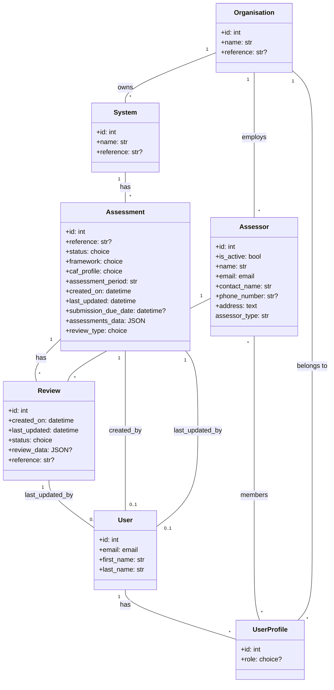
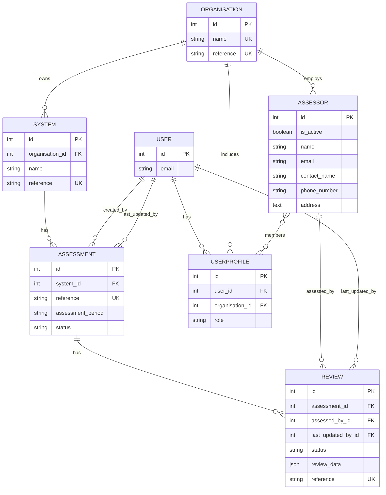
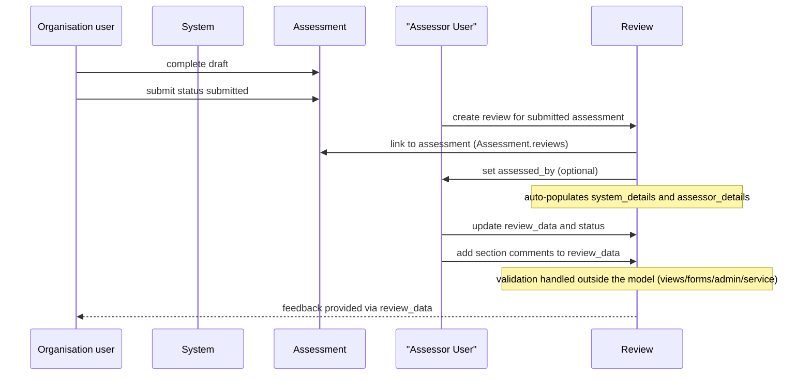

### WebCAF domain relationships: Assessment, UserProfile, Review (with context)

This README explains how the core domain entities relate to each other and provides diagrams you can render with Mermaid. It reflects the current code in `webcaf/webcaf/models.py` and the admin configuration in `webcaf/webcaf/admin.py`.

Last updated: 2025-11-19 (local)

---

### Scope and purpose
- Assessment: captures a CAF self-assessment for a given `System` and assessment period, including JSON content and completion helpers.
- UserProfile: associates a `User` with an `Organisation` and a role (`cyber_advisor`, `organisation_lead`, `organisation_user`, `assessor`).
- Review: records assurance review metadata and structured review content; tracks who last updated the review via `last_updated_by`.
- Assessor: an assessing body/entity with contact fields; belongs to an `Organisation` (FK) and has M2M to `UserProfile` (assessor members).

Context models (referenced for relationships): `Organisation`, `System`, `User`.

---

### High-level relationships
- Organisation 1—M System
- System 1—M Assessment
- Assessment 1—M Review (multiple reviews possible per assessment)
- Assessor 1—M Review (via optional FK `assessed_by` on Review)
- User 1—M UserProfile (each profile may be tied to an Organisation)
- Organisation 1—M Assessor (via `Assessor.organisation`)
- Assessor M—M UserProfile (via `Assessor.members`)

Key constraints from the current models:
- Review: `unique_together = (assessment, assessed_by)` — at most one review per assessor for a given assessment. `last_updated_by` is an optional FK to `User` for audit.
- Assessment: `unique_together = (assessment_period, system, status)` — see notes below.

---

### Notes from the implementation
- Assessment
  - Links: `system`, `created_by`, `last_updated_by`; `reference` is auto-generated.
  - Fields: `status` in `{draft, submitted, completed, cancelled}`, `framework` in `{caf32, caf40}`, `caf_profile` in `{baseline, enhanced}`.
  - JSON helpers: `get_section_by_outcome_id`, `get_sections_by_objective_id`, `is_objective_complete`, `is_complete`, `get_router()`.
  - Uniqueness currently includes `status`; if you want one row per `(system, assessment_period)` across lifecycle, consider removing `status` from the unique tuple.

- UserProfile
  - Links: `user` → User, `organisation` → Organisation (optional), `role` from choices.
  - Convenience: `ROLE_ACTIONS`, `ROLE_DESCRIPTIONS`, `get_role_id`, `get_role_label`.
  - Consider a uniqueness constraint on `(user, organisation, role)` to avoid duplicates.

- Review
  - Links: `assessment` (FK, `related_name='reviews'`), `last_updated_by` → User (nullable, tracks last editor), `assessed_by` → Assessor (nullable, FK many-to-one).
  - Constraints: unique per `(assessment, assessed_by)` (at most one review per assessor for an assessment). Business rule enforcement (e.g., only on submitted assessments) is handled in views/forms/admin or a service layer.
  - Status values: `{to_do, in_progress, clarify, completed, cancelled}`.
  - On creation: automatically populates `review_data` with `system_details` and `assessor_details` when status is `to_do` via `set_initial_data()` method.
  - Structure of `review_data`: includes `system_details` (reference, organisation, assessment_period, system_name, system_description, prev_assessments, hosting_and_connectivity, corporate_services), `assessor_details` (review_type, framework, profile, assessor contact info), and `sections` array with outcome-level comments and status.
  - Fields also include a generated `reference`.

- Assessor
  - Fields: includes `is_active: bool` to soft-enable/disable an assessor without deleting the record; `assessor_type` is a string with the values `independent` or `peer`.
  - Links: FK `organisation` (each assessor belongs to exactly one organisation), and M2M `members` to `UserProfile`.
  - Admin: listed with an `is_active` filter; `last_updated_by` is set to the acting user on save.

---

### Class diagram (Mermaid)

---

### ER diagram (Mermaid)

---

### Review lifecycle (sequence)

---

### How to view diagrams
- Many Markdown renderers support Mermaid. If your viewer does not, paste the blocks at https://mermaid.live

---

### Quick navigation and examples
- From a `System` instance: `system.assessments.all()`
- From an `Assessment` instance (multiple reviews possible): `assessment.reviews.all()` or `assessment.reviews.filter(assessed_by=assessor)`
- Find reviews last updated by a user: `Review.objects.filter(last_updated_by=user)`
- Find assessor for a review: `review.assessed_by`
- Find organisation that owns an assessor: `assessor.organisation`
- Find assessor members: `assessor.members.all()`

---

### Optional improvements
- Assessment: consider making `(assessment_period, system)` globally unique (without `status`).
- UserProfile: add `UniqueConstraint(user, organisation, role)`; optionally ensure one `organisation_lead` per `Organisation`.
