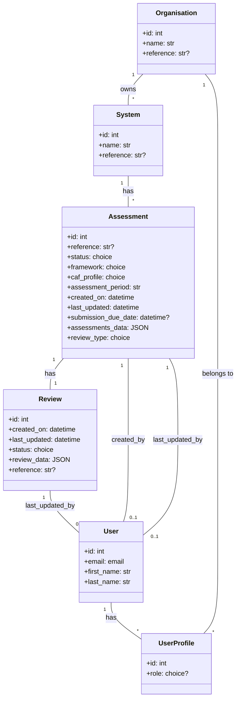
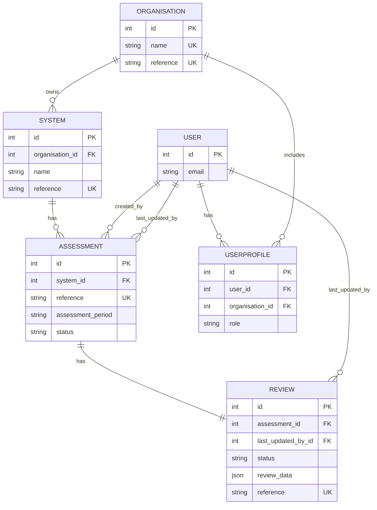

### WebCAF domain relationships: Assessment, UserProfile, Review (with context)

This README explains how the core domain entities relate to each other and provides diagrams you can render with Mermaid. It reflects the current code in `webcaf/webcaf/models.py` and the admin configuration in `webcaf/webcaf/admin.py`.

---

### Scope and purpose
- Assessment: captures a CAF self-assessment for a given `System` and assessment period, including JSON content and completion helpers.
- UserProfile: associates a `User` with an `Organisation` and a role (`cyber_advisor`, `organisation_lead`, `organisation_user`, `assessor`, `reviewer`).
- Review: records assurance review metadata and structured review content; tracks who last updated the review via `last_updated_by`.

Context models (referenced for relationships): `Organisation`, `System`, `User`.

---

### High-level relationships
- Organisation 1—M System
- System 1—M Assessment
- Assessment 1—1 Review (one review per assessment)
- User 1—M UserProfile (each profile may be tied to an Organisation)
- UserProfile M—1 Organisation

Key constraints from the current models:
- Review: `unique_together = (assessment,)` — at most one review per assessment. `last_updated_by` is an optional FK to `User` for audit.
- Assessment: `unique_together = (assessment_period, system, status)` — ensures unique assessment combinations.

---

### Class diagram (Mermaid)

---

### ER diagram (Mermaid)

---

### How to view diagrams
- Many Markdown renderers support Mermaid. If your viewer does not, paste the blocks at https://mermaid.live

---

### Quick navigation and examples
- From a `System` instance: `system.assessments.all()`
- From an `Assessment` instance (one review per assessment): `assessment.reviews.first()` or access via the reviews related manager
- Find reviews last updated by a user: `Review.objects.filter(last_updated_by=user)`
- Find assessment for a review: `review.assessment`
- Find organisation for an assessment: `assessment.system.organisation`
- Find user profiles in an organisation: `organisation.members.all()`
