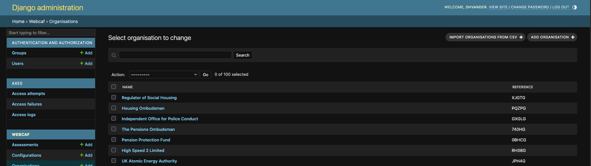

# Organisation CSV Import - Admin Documentation

## Overview

The `OrganisationAdmin` class provides CSV-based bulk import functionality for managing organisations and their associated users (for the Cyber Advisor role) within the webcaf application. This feature is accessible through the Django admin interface and allows administrators to efficiently create or update multiple organisations and assign cyber advisors in a single operation.

## Features

- **CSV Template Download**: Generate a standardized CSV template with required headers
- **Bulk Organisation Import**: Create or update multiple organisations from a CSV file
- **User Management**: Automatically create or associate cyber advisor users with organisations
- **Parent Organisation Relationships**: Establish hierarchical relationships between organisations
- **Organisation Type Support**: Set organisation types during import
- **Smart Matching**: Find existing organisations by reference or name before creating duplicates

---

## CSV Template Download

### Accessing the Template

Navigate to the Django admin interface:
1. Go to `/admin/webcaf/organisation/` (Click organisation link on the left navigation pane)
2. Access the template download via: `/admin/webcaf/organisation/import-org-csv-template/` (Available from the "Import Organisations" screen)

Click the "Import Organisations from csv" button to access the import page:

### Template Structure

The downloaded template contains the following headers:

| Column | Description | Required | Example |
|--------|-------------|----------|---------|
| `Organisation` | Name of the organisation | Yes | "Ministry of Example" |
| `Lead Government Department` | Parent organisation name | No | "Cabinet Office" |
| `Reference` | Unique organisation reference code | No | "ORG001" |
| `Type` | Organisation type | No | "Ministerial department" |
| `Email1` | First cyber advisor email | No | "advisor1@example.gov.uk" |
| `Email2` | Second cyber advisor email | No | "advisor2@example.gov.uk" |
| `Email3` | Third cyber advisor email | No | "advisor3@example.gov.uk" |
| `Email4` | Fourth cyber advisor email | No | "advisor4@example.gov.uk" |
| `Email5` | Fifth cyber advisor email | No | "advisor5@example.gov.uk" |
| `Email6` | Sixth cyber advisor email | No | "advisor6@example.gov.uk" |
#### Template fields
- `Organisation` is required
- `Lead Government Department` is optional
- `Reference` is optional—this is only used for matching existing organisations during import. The reference is generated by the system and you should not put any arbitrary value here.
- `Type` is optional
- `Email1` through `Email6` are optional

### Implementation Details

**Method**: `import_csv_template(request)`

**Location**: `webcaf/webcaf/admin.py` (lines 84-105)

**Process**:
1. Creates an in-memory CSV buffer
2. Writes headers defined in `csv_headers` attribute
3. Returns CSV file as downloadable HTTP response with filename `organisation_import_template.csv`

---

## CSV Data Import

### Accessing the Import Page

Navigate to the Django admin interface:
1. Go to `/admin/webcaf/organisation/`
2. Access the import page via: `/admin/webcaf/organisation/import-org-csv/`

### Import Process

**Method**: `import_csv(request)`

**Location**: `webcaf/webcaf/admin.py` (lines 107-209)

#### Step 1: File Upload
- Upload your completed CSV file through the web form
- The system validates that all required headers are present
- If headers are missing, an error message is displayed

#### Step 2: Organisation Processing
For each row in the CSV:

1. **Find or Create Organisation**
   - Searches for existing organisation by `Reference` field (if provided)
   - Falls back to searching by `Organisation` name
   - Creates new organisation if not found
   - Sets organisation type if valid type is provided

2. **Process Email Addresses**
   - Iterates through all email columns (Email1 through Email6)
   - Skips empty email fields
   - For each email:
     - Searches for existing user by email
     - Creates new user if not found (username = email)
     - Creates or retrieves UserProfile with role "cyber_advisor"
     - Associates user profile with the organisation

#### Step 3: Parent Organisation Assignment
After all organisations are created/updated:

1. Resets CSV reader to beginning
2. For each row with a `Lead Government Department`:
   - Finds the parent organisation by name
   - Sets parent-child relationship
   - Prevents self-referencing (organisation cannot be its own parent)
   - Clears parent if organisation is the lead department itself

#### Step 4: Completion
- Displays success message with count of imported organisations
- Redirects to organisation admin list page

### Organisation Type Values

The `Type` column accepts the following values (case-sensitive):

- "Ad-hoc advisory group"
- "Advisory non-departmental public body"
- "Agency or other public body"
- "Devolved administration"
- "Executive agency"
- "Executive non-departmental public body"
- "Executive office"
- "High profile group"
- "Ministerial department"
- "Non-ministerial department"
- "Public corporation"
- "Tribunal"
- "Other"

**Note**: If an invalid or empty type is provided, the organisation will be created without a type.

---

## Example CSV

```csv
"Organisation","Lead Government Department","Reference","Type","Email1","Email2","Email3","Email4","Email5","Email6"
"Cabinet Office","","CAB001","Ministerial department","advisor1@cabinet-office.gov.uk","advisor2@cabinet-office.gov.uk","","","",""
"Government Digital Service","Cabinet Office","GDS001","Executive agency","advisor1@digital.cabinet-office.gov.uk","","","","",""
"Ministry of Justice","","MOJ001","Ministerial department","advisor1@justice.gov.uk","advisor2@justice.gov.uk","advisor3@justice.gov.uk","","",""
```

### Example Breakdown

**Row 1**: Cabinet Office
- Creates parent organisation "Cabinet Office"
- Reference: CAB001
- Type: Ministerial department
- Assigns 2 cyber advisors

**Row 2**: Government Digital Service
- Creates child organisation "Government Digital Service"
- Parent: Cabinet Office
- Reference: GDS001
- Type: Executive agency
- Assigns 1 cyber advisor

**Row 3**: Ministry of Justice
- Creates parent organisation "Ministry of Justice"
- Reference: MOJ001
- Type: Ministerial department
- Assigns 3 cyber advisors

---

## Helper Method: find_organisation

**Method**: `find_organisation(row)`

**Location**: `webcaf/webcaf/admin.py` (lines 211-231)

### Purpose
Intelligently locates existing organisations to prevent duplicates during import.

### Search Strategy
1. **Priority 1**: Search by `Reference` field (if provided)
2. **Priority 2**: Search by `Organisation` name (if reference not found or empty)
3. **Result**: Returns `Organisation` object or `None`

### Example Usage
```python
row = {"Reference": "ORG001", "Organisation": "Example Ministry"}
organisation = self.find_organisation(row)
# Returns Organisation if found by reference or name, otherwise None
```

---

## Validation and Error Handling

### Header Validation
- CSV must contain **all** required headers
- Order of headers doesn't matter
- Missing headers result in error message and redirect

### Data Processing
- **Whitespace**: Email addresses are automatically stripped of whitespace
- **Duplicate Users**: If a user already exists for an organisation, a warning is logged
- **New Organisations**: Creating new organisations triggers a warning message
- **New Users**: Creating new users triggers a warning message
- **Invalid Types**: Invalid organisation types are ignored (organisation created without type)

### Logging
All operations are logged using Django's logging framework with logger name `"OrganisationAdmin"`:
- Organisation creation
- User creation
- Duplicate user profile warnings
- General import information

---

## Admin Messages

During import, the system displays various message types:

### Success Messages (Green)
- `"✅ Imported {count} Organisations."`

### Warning Messages (Yellow)
- `"Creating {organisation_name} as not found in the database"`
- `"Creating {email} as not found in the database."`
- `"The user with email {email} already exists in the database for the organisation {organisation}."`

### Error Messages (Red)
- `"The CSV file is missing required headers {headers}."`

---

## Technical Implementation Details

### URLs
Custom URLs are registered in the `get_urls()` method:

```python
path("import-org-csv/", self.admin_site.admin_view(self.import_csv), name="import-org-csv")
path("import-org-csv-template/", self.admin_site.admin_view(self.import_csv_template), name="import-org-csv-template")
```

### Dependencies
- `csv`: Python standard library for CSV processing
- `TextIOWrapper`: Decodes uploaded file with UTF-8 encoding
- `StringIO` and `BytesIO`: In-memory file handling
- Django's `messages` framework for user feedback

### Security
- Admin authentication required (enforced by `admin_site.admin_view`)
- CSRF protection enabled (Django default)
- User permissions checked via Django admin

---

## Best Practices

### Before Import
1. Download the CSV template
2. Fill in organisation data carefully
3. Verify email addresses are correct
4. Ensure organisation types match accepted values
5. Check parent-child relationships are correct

### During Import
1. Upload CSV file through admin interface
2. Review warning messages for created organisations/users
3. Verify success message shows expected count

### After Import
1. Navigate to organisation list in admin
2. Verify organisations were created/updated correctly
3. Check user profiles were assigned properly
4. Validate parent-child relationships

### Tips
- Use `Reference` field for existing organisations to ensure correct matching
- Leave parent organisation empty for top-level organisations
- Empty email fields are automatically skipped
- Whitespace in email addresses is automatically handled
- Organisation names must be unique across the system

---

## Troubleshooting

### Issue: "CSV file is missing required headers"
**Solution**: Ensure your CSV contains all columns from the template, even if some are empty.

### Issue: Duplicate organisations created
**Solution**: Use the `Reference` field to match existing organisations, or ensure `Organisation` names match exactly.

### Issue: User profile already exists warnings
**Solution**: This is expected when re-importing. The existing profile is retained, not duplicated.

### Issue: Parent organisation not linking
**Solution**: Ensure the `Lead Government Department` name exactly matches an existing or imported organisation name.

### Issue: Organisation type not being set
**Solution**: Verify the type value exactly matches one of the accepted values (case-sensitive).

---

## Code Location

All code referenced in this documentation is located in:
- **File**: `webcaf/webcaf/admin.py`
- **Class**: `OrganisationAdmin` (lines 49-232)
- **Methods**:
  - `import_csv_template()` - lines 84-105
  - `import_csv()` - lines 107-209
  - `find_organisation()` - lines 211-231

## Related Models

- **Organisation**: `webcaf/webcaf/models.py`
- **UserProfile**: `webcaf/webcaf/models.py`
- **User**: Django's built-in User model

## Testing

Comprehensive tests for this functionality can be found in:
- **File**: `tests/admin/test_organisation_admin.py`
- **Test Class**: `OrganisationAdminImportCSVTest`
