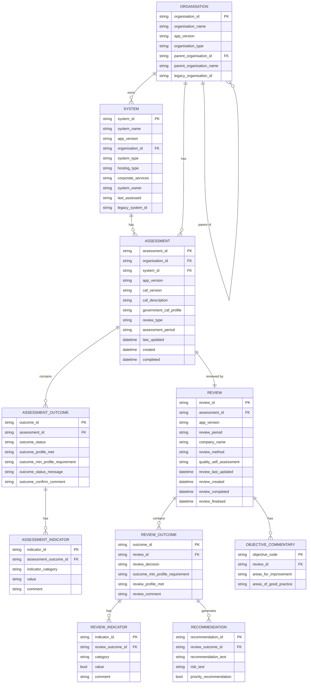

# Data Analysis Transform — Data Dictionary

Transform functions in `data_analysis.py` convert raw model data into flat, JSON-serialisable dictionaries for analytics export.

---

## Entity Relationship Diagram

---

## `transform_assessment`

Converts raw assessment data into a standardised outcome format.

### Output Schema

| Field | Type | Description |
|---|---|---|
| `app_version` | `str` | Application version at time of export |
| `organisation_id` | `str` | ID of the organisation that owns the assessment |
| `system_id` | `str` | ID of the system being assessed |
| `assessment_id` | `str` | Unique identifier of the assessment |
| `outcomes` | `list[Outcome]` | One entry per CAF outcome code (e.g. `A1.a`) |
| `metadata.last_updated` | `str \| None` | ISO datetime the assessment was last edited |
| `metadata.created` | `str \| None` | ISO datetime the assessment was created |
| `metadata.completed` | `str \| None` | ISO datetime the assessment was submitted |
| `assessment_details.caf_version` | `str` | CAF framework version used |
| `assessment_details.caf_description` | `str` | Human-readable CAF version description |
| `assessment_details.government_caf_profile` | `str \| None` | Capitalised system profile (e.g. `Baseline`) |
| `assessment_details.review_type` | `str \| None` | Type of review associated with the assessment |
| `assessment_details.assessment_period` | `str \| None` | Reporting period the assessment covers |

### Outcome Object

| Field | Type | Description |
|---|---|---|
| `outcome_id` | `str` | CAF outcome code (e.g. `A1.a`) |
| `outcome_status` | `str` | Self-assessed status string |
| `outcome_profile_met` | `str` | `"Met"`, empty string, or callback-derived value |
| `outcome_min_profile_requirement` | `str` | Minimum CAF profile requirement for this outcome |
| `outcome_status_message` | `str` | Descriptive message for the outcome status |
| `outcome_confirm_comment` | `str` | Free-text confirmation comment |
| `indicators` | `list[Indicator]` | Parsed indicator list (see Indicator Object below) |
| `supplementary_questions` | `list` | Raw supplementary question data |

### Indicator Object (Assessment)

| Field | Type | Description |
|---|---|---|
| `indicator_id` | `str` | Indicator identifier (e.g. `A1.a.1`) |
| `indicator_category` | `str` | Category prefix from the raw key |
| `value` | `Any` | Raw indicator value |
| `comment` | `str` | Associated free-text comment |

---

## `transform_review`

Converts raw assessor review data into the standardised outcome format.

### Output Schema

| Field | Type | Description |
|---|---|---|
| `app_version` | `str` | Application version at time of export |
| `assessment_id` | `str` | ID of the associated assessment |
| `review_details.review_period` | `dict \| None` | IAR period object |
| `review_details.company_name` | `str \| None` | Reviewing company name |
| `review_details.review_method` | `str \| None` | Method used to conduct the review |
| `review_details.quality_self_assessment` | `str \| None` | Assessor's rating of evidence quality |
| `outcomes` | `list[ReviewOutcome]` | One entry per CAF outcome code |
| `metadata.review_last_updated` | `str \| None` | ISO datetime the review was last edited |
| `metadata.review_created` | `str \| None` | ISO datetime the review was created |
| `metadata.review_completed` | `str \| None` | ISO datetime the review was completed |
| `metadata.review_finalised` | `str \| None` | ISO datetime the review was finalised |
| `review_commentary.objective_level` | `list[ObjectiveCommentary]` | Per-objective commentary |
| `review_commentary.overall.areas_for_improvement` | `str \| None` | Overall improvement areas |
| `review_commentary.overall.areas_of_good_practice` | `str \| None` | Overall good practice areas |

### Review Outcome Object

| Field | Type | Description |
|---|---|---|
| `outcome_id` | `str` | CAF outcome code (e.g. `A1.a`) |
| `review_decision` | `str \| None` | Label-mapped decision: `Achieved`, `Not achieved`, `Partially achieved`, `N/A` |
| `outcome_min_profile_requirement` | `str` | Minimum CAF profile requirement |
| `review_profile_met` | `str` | `"Met"`, empty string, or callback-derived value |
| `review_comment` | `str` | Assessor's free-text comment |
| `indicators` | `list[ReviewIndicator]` | Parsed indicators with boolean values |
| `recommendations` | `list[Recommendation]` | Recommendations for this outcome |

### Indicator Object (Review)

| Field | Type | Description |
|---|---|---|
| `indicator_id` | `str` | Indicator identifier |
| `category` | `str` | Category prefix from the raw key |
| `value` | `bool` | `True` if raw value is `"yes"`, else `False` |
| `comment` | `str` | Associated free-text comment |

### Recommendation Object

| Field | Type | Description |
|---|---|---|
| `recommendation_id` | `str` | Deterministic ID of the form `REC-<OUTCOME>N` (e.g. `REC-A1A1`) |
| `recommendation_text` | `str \| None` | Full recommendation text |
| `risk_text` | `str \| None` | Associated risk title |
| `priority_recommendation` | `bool \| str` | `True` if profile not met; `""` if profile_met is falsy |

### Objective Commentary Object

| Field | Type | Description |
|---|---|---|
| `objective_code` | `str` | Objective group code (e.g. `A`, `B`, `C`, `D`) |
| `areas_for_improvement` | `str \| None` | Commentary on improvement areas for this objective |
| `areas_of_good_practice` | `str \| None` | Commentary on good practice for this objective |

---

## `transform_organisation`

Converts raw organisation data into a standardised flat dictionary.

### Output Schema

| Field | Type | Required | Description |
|---|---|---|---|
| `organisation_name` | `str` | Yes | Display name of the organisation |
| `organisation_id` | `str` | Yes | Unique identifier |
| `app_version` | `str` | Yes | Application version at time of export |
| `organisation_type` | `str \| None` | No | Classification of the organisation |
| `parent_organisation_id` | `str \| None` | No | ID of the parent organisation |
| `parent_organisation_name` | `str \| None` | No | Name of the parent organisation |
| `legacy_organisation_id` | `str \| None` | No | Legacy system identifier |

---

## `transform_system`

Converts raw system data into a standardised flat dictionary.

### Output Schema

| Field | Type          | Required | Description |
|---|---------------|---|---|
| `system_name` | `str`         | Yes | Display name of the system |
| `system_id` | `str`         | Yes | Unique identifier |
| `app_version` | `str`         | Yes | Application version at time of export |
| `system_type` | `str \| None` | No | Classification of the system |
| `hosting_type` | `str \| None` | No | Hosting environment (e.g. cloud, on-premise) |
| `corporate_services` | `str \| None` | No | Corporate services associated with the system |
| `system_owner` | `str \| None` | No | Owner or responsible party for the system |
| `organisation_id` | `str \| None` | No | ID of the owning organisation |
| `last_assessed` | `str \| None` | No | ISO date of the most recent assessment |
| `legacy_system_id` | `str \| None` | No | Legacy system identifier |
